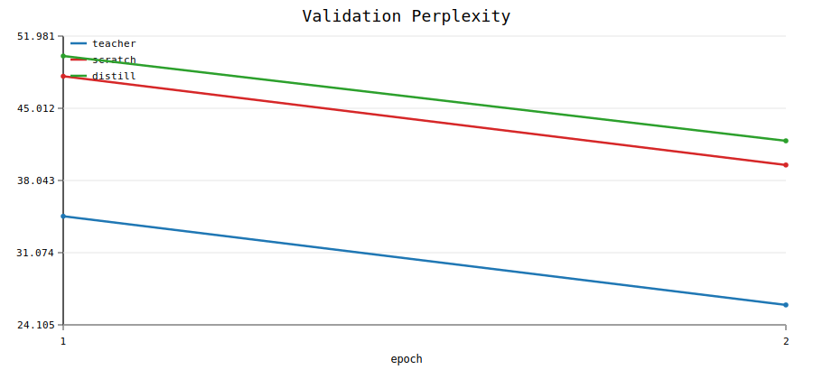

# distill-lab

PyTorch project for teacher-student language model distillation.

This repo is built to answer a simple question: how much of a larger language model can you preserve in a smaller student when you distill logits, hard labels, and optional hidden states? The codebase is intentionally small, config-driven, and easy to run locally.

## Usage examples

### 1. Fast smoke test

Run the full teacher vs student-from-scratch vs distilled-student workflow on a synthetic corpus:

```bash
python -m src.train --config configs/teacher_toy.yaml
python -m src.train --config configs/student_scratch_toy.yaml
python -m src.train --config configs/student_distill_toy.yaml
python scripts/summarize_runs.py   results/teacher_toy   results/student_scratch_toy   results/student_distill_toy   --labels teacher scratch distill   --output-dir results/reports/toy
```

### 2. Real-text distillation with subword tokenization

Train a larger teacher and smaller student on the checked-in Tiny Shakespeare corpus using the repo's byte-level BPE tokenizer:

```bash
python -m src.train --config configs/teacher_shakespeare_bpe.yaml
python -m src.train --config configs/student_scratch_shakespeare_bpe.yaml
python -m src.train --config configs/student_distill_shakespeare_bpe.yaml
python -m src.eval --config configs/student_distill_shakespeare_bpe.yaml
python scripts/summarize_runs.py   results/teacher_shakespeare_bpe   results/student_scratch_shakespeare_bpe   results/student_distill_shakespeare_bpe   --labels teacher scratch distill   --output-dir results/reports/shakespeare_bpe
```

### 3. Open-data workflow for larger experiments

Prepare a standard open corpus, then run the same teacher/student/distillation pipeline:

```bash
python scripts/prepare_wikitext2.py
python -m src.train --config configs/teacher_wikitext2_bpe.yaml
python -m src.train --config configs/student_scratch_wikitext2_bpe.yaml
python -m src.train --config configs/student_distill_wikitext2_bpe.yaml
```

Or normalize local TinyStories shards into `train.txt` and `val.txt` first:

```bash
python scripts/prepare_tinystories.py --source-dir /path/to/TinyStories
python -m src.train --config configs/teacher_tinystories_bpe.yaml
python -m src.train --config configs/student_scratch_tinystories_bpe.yaml
python -m src.train --config configs/student_distill_tinystories_bpe.yaml
```

## Open-source model use case

The intended next step is distilling a pretrained open model such as `gpt2` or a SmolLM-style teacher into a smaller custom student on WikiText-2 or TinyStories. This repo already has the reusable pieces for that workflow:

- teacher-student distillation loss with KL, CE, and hidden-state matching
- local BPE tokenization and text chunking
- experiment summaries, comparison tables, and SVG plots
- configs for open corpora that mirror a real language-model distillation setup

What is not added yet is the adapter layer for loading logits and hidden states from a pretrained external teacher checkpoint. The current configs train the teacher locally.

## Example output

Below is a real validation-perplexity plot produced by the reporting script from a verified local smoke run. All three runs improve over training, and the teacher improves fastest on this tiny setup.



Example summary from that run:

| run | best val ppl | best val acc | params |
| --- | ---: | ---: | ---: |
| teacher | 26.0278 | 0.2137 | 12053 |
| scratch | 39.5372 | 0.1183 | 4005 |
| distill | 41.8707 | 0.0878 | 4005 |

## What the repo includes

- teacher training, student baseline training, and student distillation
- synthetic, char-tokenized, word-tokenized, and BPE-tokenized data paths
- dataset prep scripts for WikiText-2 and TinyStories
- reporting tools that write `summary.csv`, `summary.md`, and SVG plots
- YAML configs for toy, Shakespeare, WikiText-2, and TinyStories experiments

## Minimal project map

```text
configs/   experiment definitions
scripts/   dataset prep and reporting CLIs
src/       training, evaluation, tokenization, and losses
data/      local corpora
artifacts/ saved tokenizer models
results/   checkpoints and metrics
```

## Notes

- The first BPE run will create a tokenizer model under `artifacts/tokenizers/` and later runs will reuse it.
- `scripts/summarize_runs.py` turns `metrics.jsonl` files into CSV, Markdown, and SVG artifacts.
- The Shakespeare char and BPE paths were exercised locally in this environment. The remote dataset download flows were added but not executed here because network access is restricted.
